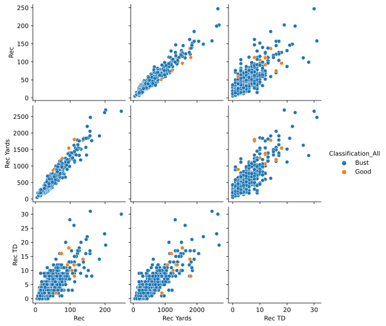

# Feature selection notes

## QBs

In the scatter plot for QBs you can see a couple of things about the features, upon which I decided to leave out some
features.

- Rush Attempts, Rush Yards and Rush TDs all provide very valuable information, which, between the three, is only a
  correlating slightly, but not too much. Will include all three!
- I'll drop Pass Yards, as it holds too much similar information with both Pass TDs and Pass Completions.
- Pass Ints will be included, as it holds good new information compared e.g. with Pass TDs.
- Pass Attempts is conflicting, doesn't hold too much information that Pass Completions does not yet hold, but it is
  able to differentiate in a couple of edge cases (very high attempt ratio).
- Comp Percentage will be included as it doesn't really correlate with any of the existing features so far.


### Best models

- Random Forest: max_depth: 15, max_features: 3, min_samples_leaf: 1, min_samples_split: 0.02, n_estimators: 35
- Nearest Neighbors: 2
- MLP: alpha: 0.001, batch_size: 475, activation: logistic, hidden_layers: 195, learning rate: constant, max_iter: 1300,
  early_stopping: False
- Decision Trees: max_depth=15, min_samples_split=0.05, max_features=2
- SVC: C: 10000, kernel: rbf

## RBs

For RBs, depending again on the scatter plot, the following features can be sorted out/used:

- Rush Att and Rush Yards hold the same information - Yards will be chosen
- Receptions and Reception Yards hold the same information - Yards will be chosen
- The other features should hold a fair amount of information about the classification problem.


### Best Models

- Nearest Neighbors: n_neighbors=2 (or 5)
- SVC: kernel=rbf, C=100000
- MLP: NN{'activation': 'logistic', 'alpha': 10000, 'batch_size': 220, 'early_stopping': False, 'hidden_layer_sizes':
  230, 'learning_rate': 'invscaling', 'max_iter': 775}
- Decision Trees: {'max_depth': 5, 'max_features': 2, 'min_samples_leaf': 1, 'min_samples_split': 0.2}
- Random Forest: {'max_depth': 5, 'min_samples_leaf': 2, 'min_samples_split': 5, 'n_estimators': 40}

## WRs

Following notes about features have been made:

- Receptions and Reception Yards hold the same information, Receptions will be dropped
- Rushing attempts and Rushing Yards hold similar information, while rushing attempts don't make too much sense anyhow -
  Attempts will be dropped.


### Best Models

- Nearest Neighbors: n_neighbors: 5
  - With resampling, no scaling, 0,75 AUC and 0,15 Pre/Recall 
  - 15 neighbors make better results, but don't classify any of the good players correctly. 
- SVC: kernel: rbf, c=100000
  - Best results auc/f1 wise with resampling and no scaling, however confusion matrice shows a lot of false positives ==> maybe not ideal
- MLP: {'activation': 'tanh', 'alpha': 0.003, 'batch_size': 495, 'early_stopping': False, 'hidden_layer_sizes': 975, 'learning_rate': 'constant', 'max_iter': 925} model
  - with resampling, otherwise 0 positive classifications
  - without resampling, with scaling ==> only 4 positive classifications (1/4 correct), but very good values
- Decision Trees: {'max_depth': 17, 'max_features': 3, 'min_samples_leaf': 1, 'min_samples_split': 0.08}
  - everything above min_samples_split 0.05 is dangerously close to overfit, 0.10 was the limit of what was working already
  - balancing the data set helps predict more positive samples, but also holds more false positives as a consequence
- Random Forest: {'max_depth': 18, 'max_features': 2, 'min_samples_leaf': 1, 'min_samples_split': 0.05, 'n_estimators': 80}
  - With rebalancing, otherwise only predicts negatives

## TEs

Feature selection: 
- Although some features correlate quite a bit, all will be kept since we only have 3 features that make sense



### Best Models

- Nearest Neighbors: n_neighbors:5, 
  - scaled and rebalanced
- SVC: {'C': 100000, 'degree': 2, 'kernel': 'rbf'} 
- MLP: {'max_iter': 900, 'learning_rate': 'constant', 'hidden_layer_sizes': 100, 'early_stopping': False, 'batch_size': 10, 'alpha': 0.001, 'activation': 'relu'} model
  - with resampling
- Decision Trees: {'max_depth': 16, 'max_features': 1, 'min_samples_leaf': 1, 'min_samples_split': 0.02}
  - scaled and rebalanced
- Random Forest: {'max_depth': 8, 'max_features': 1, 'min_samples_leaf': 2, 'min_samples_split': 0.05, 'n_estimators': 55} 
  - Needs resampling and scaling with scaler to lead to good results

## LBs

## DBs
No features seem to hold a great deal of redundancy with each other, therefore all the chosen ones will be kept.


### Best Models

- SVC: rbf, C=100
  - with resampling, no scaling
- NN: {'activation': 'tanh', 'alpha': 0.01, 'batch_size': 100, 'early_stopping': True, 'hidden_layer_sizes': 1000, 'learning_rate': 'constant', 'max_iter': 500}
  - with resampling, no scaling (0.79, 0.26, accuracy not that great but done for trade-off with auc/f1)
- Nearest Neighbors: 15 neighbors
  - no resampling, no scaling leads to best results
- Random Forest: {'max_depth': 15, 'max_features': 3, 'min_samples_leaf': 1, 'min_samples_split': 0.1, 'n_estimators': 70
  - with resampling, no scaling
- Decision Tree: {'max_depth': 20, 'max_features': 6, 'min_samples_leaf': 1, 'min_samples_split': 0.075}
  - resampling, but no scaling


## DL
Features:

- Broken up passes not really that relevant --> leave it out
- Tackles for loss and Sacks are the only statistic that is even remotely redundant, will try without
- Rest of the features stays in

### Best Models

- SVC: SVC{'C': 10000, 'kernel': 'rbf'}
  - no scaling, with resampling
- NN: {'activation': 'tanh', 'alpha': 0.0001, 'batch_size': 150, 'early_stopping': True, 'hidden_layer_sizes': 100, 'learning_rate': 'constant', 'max_iter': 860}
  - no scaling, with resampling
  - without features: Tackle Assist: 0.78, 0.22
  - without Tackle Solo: 0.77, 0.20
- NearestNeighbors{'n_neighbors': 7}
  - no scaling, resampling
- RandomForest{'max_depth': 22, 'max_features': 4, 'min_samples_leaf': 2, 'min_samples_split': 0.05, 'n_estimators': 38}
  - no scaling, resampling
- DecisionTree{'max_depth': 21, 'max_features': 2, 'min_samples_leaf': 1, 'min_samples_split': 0.04}
  - no scaling, resampling


## NOTES

### Precision and Recall

If our model predicted 30 Good players, but only 3 of them are really Good, our precision is 3/30. If our model
predicted 30 Good players, 3 of them correctly, and there are 20 overall Good players, our recall is 3/20.

Ideally, we wanna be good in both values, but we are very bad in precision.

## Starting parameters
### Neural Network starting params:

alpha parameter is used as overfitting measure by adding weight decay, penalizing large weights in the network.

```
'NN': {'hidden_layer_sizes': [10, 100, 250, 500, 1000],
               'alpha': [0.001, 0.01, 0.1, 1],
               'activation': ['logistic', 'tanh', 'relu', 'identity'],
               'batch_size': [10, 50, 100, 150, 200, 400, 600],
               'learning_rate': ['constant', 'invscaling', 'adaptive'],
               'max_iter': [500, 1000, 1500, 2000],
               'early_stopping': [False, True]
               }
```

### SVC starting params:
Never tune linear kernels --> takes forever and doesn't come to an end
```
        'SVC': {'kernel': ['rbf', 'logistic', 'poly'],
                'C': [0.00001, 0.0001, 0.001, 0.01, 0.1, 1, 10, 100, 1000, 10000, 100000],
                'degree': [2, 3, 4, 5],
                },
```

### Decision Tree starting params

``` 
'DecisionTree': {
            'max_depth': [5, 10, 20, 40, 70, 100, 150],
            'min_samples_split': [0.05, 0.1, 0.2, 0.4, 0.5],
            'min_samples_leaf': [1, 2, 3, 5],
            'max_features': [1, 2, 3, 4]
        },
```

### Random Forest starting params

``` 
        'RandomForest': {'max_depth': [5, 10, 20, 40, 70, 100, 150],
                         'n_estimators': [2, 4, 8, 16, 32, 64],
                         'min_samples_split': [0.05, 0.1, 0.2, 0.3],
                         'min_samples_leaf': [2, 3, 5],
                         'max_features': [1, 2, 3, 4]
                         },
```

### Nearest Neighbors

```
        'NearestNeighbors': {'n_neighbors': [2, 3, 4, 5, 6, 7, 8, 9, 10, 11, 12, 13, 14, 15]},
```